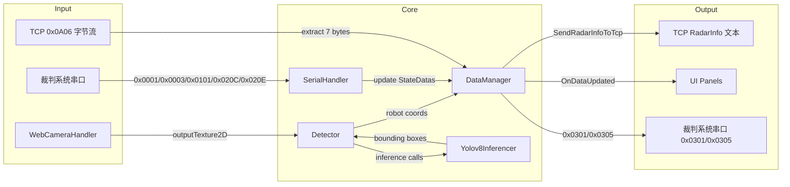

# 项目通信接口与信息架构（字段级）

本文档基于当前代码实现，梳理已有通信接口与信息架构（字段级/协议字段）。

## 1. 总体信息架构

### 1.1 主要模块

- DataManager：运行时数据中心；维护 StateDatas；负责 TCP 桥接与串口发送。
- SerialHandler：串口协议收发与解析；解析裁判系统数据。
- Detector：推理与三维定位；把目标位置写入 DataManager。
- WebCameraHandler：摄像头采集、渲染与切换。
- UI：展示层（MainUI/IOHandleUI/CalibrationUI）。

### 1.2 核心数据结构（StateDatas）

- StateDatas
  - enemyRobots: RobotSets
  - allieRobots: RobotSets
  - enemyFacilities: RobotSets
  - allieFacilities: RobotSets
  - radarInfo: RadarInfo
  - gameState: GameState

- RobotSets
  - Data: Dictionary<RobotType, RobotState>

- RobotState
  - IsTracked: bool
  - Position: Vector3
  - LastUpdateTime: DateTime
  - HP: int

- GameState
  - GameStage: GameStage
  - GameTimeSeconds: int
  - GameCount: int
  - EnemySide: Team

- RadarInfo
  - DoubleDebuffChances: int
  - IsDoubleDebuffAble: bool
  - EncryptionRank: int
  - IsModifyKeyAble: bool
  - RadarMarkProgress: ushort

## 2. 串口协议（裁判系统）

### 2.1 帧结构

- 帧头 FrameHeader (Pack=1)
  - SOF: byte (固定 0xA5)
  - DataLength: ushort (数据长度)
  - Sequence: byte
  - Crc8: byte

- 帧体 FrameBody (Pack=1)
  - CommandId: ushort
  - Data: byte[512] (固定最大长度)
  - Crc16: ushort

- 计算
  - Header: CRC8
  - Header+Body: CRC16

### 2.2 指令与字段

#### 0x0001 Game Status

- 结构: GameStatus
  - GameTypeAndStage: byte
    - GameType: 低 4 bit
    - GameStage: 高 4 bit
  - StageRemainTime: ushort
  - SyncTimestamp: ulong

#### 0x0003 Game Robot HP

- 结构: GameRobotHp
  - Red1, Red2, Red3, Red4, Red5, Red7: ushort
  - RedOutpost, RedBase: ushort
  - Blue1, Blue2, Blue3, Blue4, Blue5, Blue7: ushort
  - BlueOutpost, BlueBase: ushort

#### 0x0101 Event Data

- 结构: EventData (uint)
  - bit0: IsSupplyAreaOccupied
  - bit1: IsReservedBit1Set
  - bit2: IsSupplyAreaOccupied3
  - bit3-4: LittleEnergyOrganStatus
  - bit5-6: BigEnergyOrganStatus
  - bit7-8: CentralHighlandStatus
  - bit9-10: TrapezoidalHighlandStatus
  - bit11-19: EnemyDartHitTime
  - bit20-22: EnemyDartHitTarget
  - bit23-24: CenterGainPointStatus
  - bit25-26: FortressGainPointStatus
  - bit27-28: OutpostGainPointStatus
  - bit29: IsBaseGainPointOccupied
  - bit30-31: reserved

#### 0x020C Radar Mark Progress

- 结构: RadarMarkProgress (ushort)
  - bit0: IsOpponentHeroDebuffed
  - bit1: IsOpponentEngineerDebuffed
  - bit2: IsOpponentInfantry3Debuffed
  - bit3: IsOpponentInfantry4Debuffed
  - bit4: IsOpponentAerialMarked
  - bit5: IsOpponentSentryDebuffed
  - bit6: IsAllyHeroMarked
  - bit7: IsAllyEngineerMarked
  - bit8: IsAllyInfantry3Marked
  - bit9: IsAllyInfantry4Marked
  - bit10: IsAllyAerialMarked
  - bit11: IsAllySentryMarked

#### 0x020E Radar Status

- 结构: RadarInfo (byte RadarInfoData)
  - bit0-1: DoubleDebuffChances (0-2)
  - bit2: IsDoubleDebuffAble
  - bit3-4: EncryptionRank
  - bit5: IsModifyKeyAble
  - bit6-7: reserved

#### 0x0301 RobotInteraction_Radar (发送)

- 结构: RobotInteraction_Radar
  - dataCmdId: ushort (固定 0x0121)
  - senderId: ushort (蓝方 9 / 红方 109)
  - receiverId: ushort (固定 0x8080)
  - data: RadarDecisionCmd0121

- 结构: RadarDecisionCmd0121 (8 bytes)
  - radar_cmd: byte
    - 雷达触发双倍易伤计数，开局 0，合法增量 +1，最大 2
  - password_cmd: byte
  - password_1..password_6: byte

#### 0x0305 Map Robot Data (发送)

- 结构: MapRobotData (坐标单位: cm)
  - OpponentHeroPositionX/Y: ushort
  - OpponentEngineerPositionX/Y: ushort
  - OpponentInfantry3PositionX/Y: ushort
  - OpponentInfantry4PositionX/Y: ushort
  - OpponentAerialPositionX/Y: ushort
  - OpponentSentryPositionX/Y: ushort
  - AllyHeroPositionX/Y: ushort
  - AllyEngineerPositionX/Y: ushort
  - AllyInfantry3PositionX/Y: ushort
  - AllyInfantry4PositionX/Y: ushort
  - AllyAerialPositionX/Y: ushort
  - AllySentryPositionX/Y: ushort

## 3. TCP 接口（本地桥接）

### 3.1 TCP 接收（bridge listener）

- 端口: tcpListenPort (默认 2000)
- 监听地址: 0.0.0.0
- 协议: 原始字节流
- 解析规则:
  - 在字节流中搜索小端序 0x0A06 (字节序列 06 0A)
  - 匹配后取其后 7 字节，写入雷达决策密码后缀
  - 每解析一个 0x0A06，pendingDecisionCmdCount++

### 3.2 TCP 发送（sender client）

- 目标: tcpSendHost:tcpSendPort (默认 192.168.1.10:2001)
- 文本协议: UTF-8 字符串
- 格式:
  - RadarInfo,EncryptionRank={rank},IsModifyKeyAble={0|1}\n
## 4. 推理与数据流

### 4.1 数据流图

- WebCameraHandler 输出每个 RaycastCameraType 的 outputTexture2D。
- Detector 使用 Yolov8Inferencer 对整帧与目标框进行推理。
- Detector 将推理结果通过 Raycast 投射到场景，形成敌我坐标。
- DataManager 将坐标写入 StateDatas，并按频率发送 0x0305。

## 5. UI 关键联动（数据与接口）

- MainUI 订阅 DataManager.OnDataUpdated、OnDoubleDebuffChancesEnabled
- IOHandleUI 触发串口扫描/连接，摄像头扫描/连接
- CalibrationUI 使用相机图像与标定点（PnP逻辑暂未启用）
